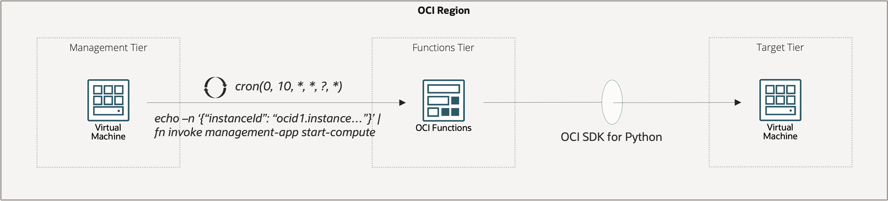
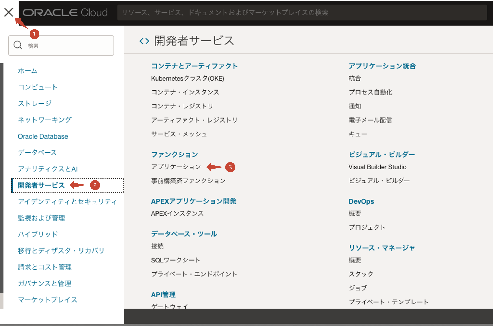
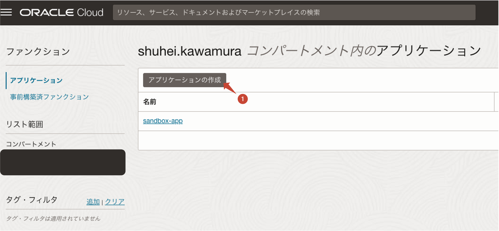
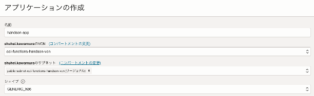
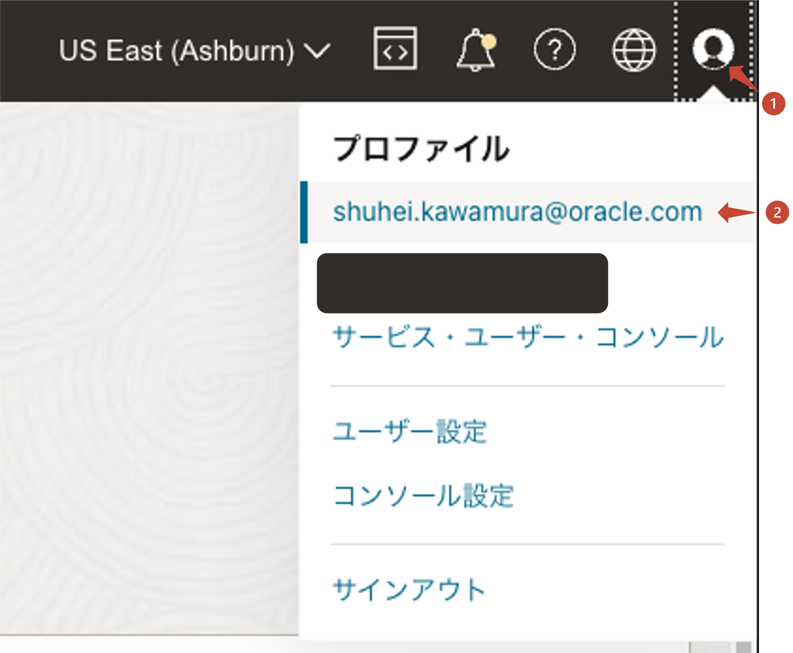
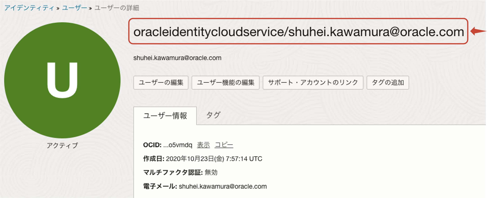
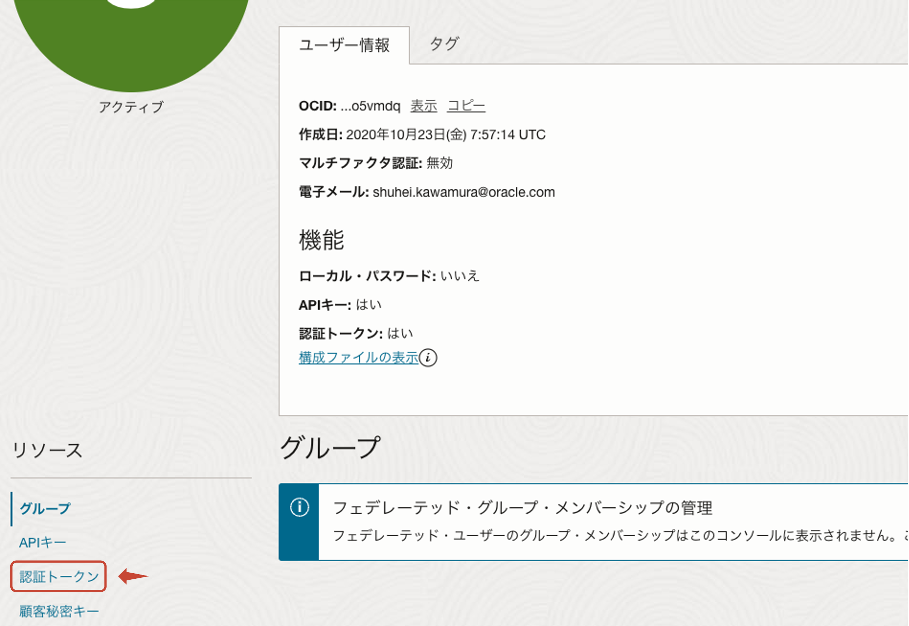
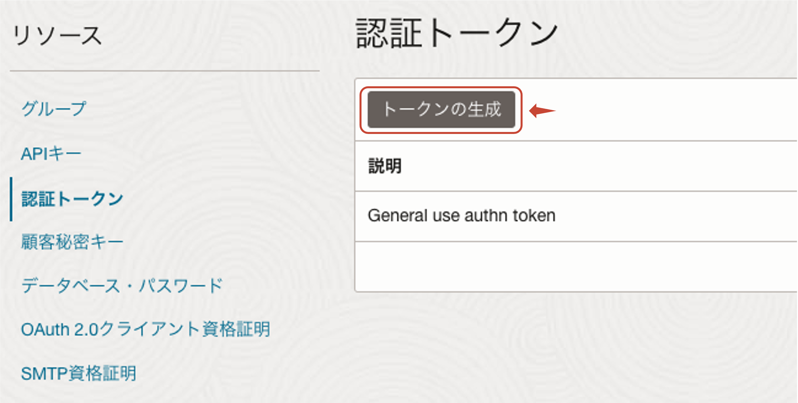

# OCI Functions + SDK for Python Hands-on

<!-- @import "[TOC]" {cmd="toc" depthFrom=2 depthTo=6 orderedList=false} -->

<!-- code_chunk_output -->

- [前提条件](#前提条件)
- [ハンズオンの全体像](#ハンズオンの全体像)
- [事前準備](#事前準備)
  - [ハンズオンに使用するリソースのクローン](#ハンズオンに使用するリソースのクローン)
  - [OCI Functions 実行用と起動対象の Compute Instance の作成](#oci-functions-実行用と起動対象の-compute-instance-の作成)
- [OCI Functions + SDK for Python のハンズオン](#oci-functions--sdk-for-python-のハンズオン)
  - [OCI Functions の実行環境の作成](#oci-functions-の実行環境の作成)
    - [アプリケーションの作成](#アプリケーションの作成)
    - [コンテキストの更新](#コンテキストの更新)
  - [OCI Functions の実行](#oci-functions-の実行)
    - [実行する Function コードの概要説明](#実行する-function-コードの概要説明)
    - [OCIR にログインするための資格情報を取得する](#ocir-にログインするための資格情報を取得する)
    - [Function コードを OCI Functions にデプロイする](#function-コードを-oci-functions-にデプロイする)
    - [起動対象の Compute Instance を停止する](#起動対象の-compute-instance-を停止する)
    - [OCI Functions を用いて、Compute Instance を起動する](#oci-functions-を用いて-compute-instance-を起動する)
    - [（オプション）Cron を用いた Functions の定期実行](#オプションcron-を用いた-functions-の定期実行)

<!-- /code_chunk_output -->

## 前提条件

- Compute, OCI Functions を実行するために必要なポリシーや仮想ネットワーク(VCN)が作成済みであること
- Cloud Shell が使用可能な環境であること
  - 未実施の場合は、[Oracle Cloud Infrastructure ドキュメント - クラウド・シェル](https://docs.oracle.com/ja-jp/iaas/Content/API/Concepts/cloudshellintro.htm)を参考に、必要なポリシー等を設定してください
  - Cloud Shell/OCI Functions の CPU アーキテクチャは、X86 で統一すること
- 各種ツール、言語、ライブラリのバージョンは、Cloud Shell に事前にインストールされているものに従います
  - OCI CLI: 3.37.11
  - Fn Project: 0.6.29
  - Python: 3.8.13
  - SDK for Python: 2.124.1

## ハンズオンの全体像



管理用の Compute Instance から、Cron にて OCI Functions の実行をトリガーします。起動された OCI Functions は、SDK for Python を用いて実装された Compute Instance の起動を行います。

## 事前準備

### ハンズオンに使用するリソースのクローン

ハンズオン実施のために、本リポジトリを Cloud Shell 上にクローンします。

```sh
git clone https://github.com/shukawam/oci-functions-handson.git
```

クローンしたリポジトリは以下のような構成となっています。

```sh
tree
```

### OCI Functions 実行用と起動対象の Compute Instance の作成

※以下の作業は、Cloud Shell 上より Terraform を用いて実行しますが、OCI Console から実施いただいても問題ございません。

`./terraform/variables.tfvars.example` をコピーし、`./terraform/variables.tfvars` を作成します。

```sh
cp ./terraform/variables.tfvars.example ./terraform/variables.tfvars
```

ハンズオンの実施環境に合わせて、適宜修正します。

```hcl
region = "ap-tokyo-1" # デフォルトは、東京（ap-tokyo-1）ですが、変更する場合は適宜修正してください
compartment_ocid = "" # ハンズオン対象のCompartment OCIDを指定します
subnet_ocid = "" # 作成済みのVCN内に含まれているPublic Subnetを指定します
resource_prefix = "" # Compute Instanceなどにつける名前が重複しないように適当なPrefixを設定します
ssh_authorized_keys_path = "" # インスタンスにSSH接続するため、公開鍵を設定します
```

Terraform にて、実行計画を確認します。

```sh
terraform plan -var-file variables.tfvars
```

以下のようなログが出力されることを確認します。

```sh
# ... 省略 ...
Plan: 2 to add, 0 to change, 0 to destroy.

Changes to Outputs:
  ~ public_ip_of_management_instance = "129.153.46.126" -> (known after apply)
  ~ public_ip_of_target_instance     = "141.148.83.109" -> (known after apply)

─────────────────────────────────────────────────────────────────────────────────────────────────────────────────────────────────────────────────────────────────────────────────────────────────────────────

Note: You didn't use the -out option to save this plan, so Terraform can't guarantee to take exactly these actions if you run "terraform apply" now.
```

環境をプロビジョニングします。（完了まで 2~3 分を要します）

```sh
terraform apply -var-file variables.tfvars -auto-approve
```

以下のようなログが出力されることを確認します。

```sh
# ... 省略 ...
Apply complete! Resources: 2 added, 0 changed, 0 destroyed.

Outputs:

public_ip_of_management_instance = "129.153.46.126"
public_ip_of_target_instance = "141.148.83.109"
```

これで、Cron の実行環境と起動対象の Compute Instance が作成されました。

## OCI Functions + SDK for Python のハンズオン

### OCI Functions の実行環境の作成

#### アプリケーションの作成

OCI Console にて、OCI Functions の実行環境を作成していきます。ハンバーガーメニュー > 開発者サービス > ファンクション > アプリケーションとクリックします。



アプリケーションの作成をクリックします。



以下のように入力し、アプリケーションを作成します。

- 名前: handson-app-\<ご自身の名前等\>
- VCN: 作成済みの VCN
- サブネット: 作成済み VCN に含まれるパブリック・サブネット
- シェイプ: GENERIC_X86



#### コンテキストの更新

> ![NOTE]
> OCI Functions におけるコンテキストとは、OCI Functions の各種設定（実行する API エンドポイント、認証するためのプロバイダー、使用するコンテナレジストリのベースパス、コンパートメント ID）などをまとめた単位のこと

アプリケーションの作成が完了したら、Cloud Shell を再度開いて、以下のように実行します。

```sh
fn list context
```

実行結果

```sh
CURRENT NAME            PROVIDER        API URL                                                 REGISTRY
*       ap-tokyo-1      oracle-cs       https://functions.ap-tokyo-1.oci.oraclecloud.com
        default         oracle-cs
        us-ashburn-1    oracle-cs       https://functions.us-ashburn-1.oci.oraclecloud.com
```

今回のハンズオンで使用するリージョンを選択します。（都合上、us-ashburn-1 で進めますが、ap-tokyo-1 でも同様に実施いただけます）

```sh
fn use context us-ashburn-1
```

実行結果

```sh
Now using context: us-ashburn-1
```

使用するコンテキストを更新します。

```sh
COMPARTMENT_ID=<ハンズオンで使用するコンパートメントID>
fn update context oracle.compartment-id $COMPARTMENT_ID
```

実行結果

```sh
Current context updated oracle.compartment-id with <ハンズオンで使用するコンパートメントID>
```

ハンズオンで使用するコンテナ・レジストリ（OCIR）のベースパスをコンテキストに設定するために、Object Storage の namespace を取得します。

```sh
oci os ns get
```

実行結果

```sh
{
  "data": "<namespace>"
}
```

便宜上、実行結果を変数に格納しておきます。

```sh
NAMESPACE="<namespace>"
```

ハンズオンで使用するコンテナ・レジストリ（OCIR）のベースパスをコンテキストに設定します。
ここでの、任意の名前はハンズオン環境内で一意となるように設定してください（ご自身の名前や a, b, c, ...など）

```sh
# Ashburn で実施している場合
fn update context registry iad.ocir.io/${NAMESPACE}/<任意の名前>
# Tokyo で実施している場合
fn update context registry nrt.ocir.io/${NAMESPACE}/<任意の名前>
```

実行結果例（環境によって実行結果は異なります）

```sh
Current context updated registry with iad.ocir.io/<namespace>/shukawam
```

ここで、今までの設定事項を確認してみましょう。

```sh
fn inspect context
```

実行結果例（環境によって実行結果は異なります）

```sh
Current context: us-ashburn-1

api-url: https://functions.us-ashburn-1.oci.oraclecloud.com
oracle.compartment-id: <ハンズオンで使用するコンパートメントID>
provider: oracle-cs
registry: iad.ocir.io/<namespace>/shukawam
```

### OCI Functions の実行

#### 実行する Function コードの概要説明

今回実行する Function コードは以下のように実装されています。

```py
import io
import json
import logging
import os
import time

import oci
from fdk import response

rp = os.getenv("OCI_RESOURCE_PRINCIPAL_VERSION", "") # ... 1
if rp == "2.2":
    signer = oci.auth.signers.get_resource_principals_signer() # ... 1
else:
    signer = oci.auth.signers.InstancePrincipalsSecurityTokenSigner() # ... 1

compute_client = oci.core.ComputeClient(config={}, signer=signer) # ... 2

def handler(ctx, data: io.BytesIO = None):
    try:
        body = json.loads(data.getvalue()) # ... 3
        instance_id = body.get("instance_id") # ... 3
    except (Exception, ValueError) as ex:
        logging.getLogger().info('error parsing json payload: ' + str(ex))
    logging.getLogger().info("Inside start compute function")
    launch_instance_status = launch_instance(instance_id) # ... 4
    if launch_instance_status == True:
        return response.Response(
            ctx, response_data=json.dumps(
                {"message": f"launch instance {instance_id} is successfull"}),
            headers={"Content-Type": "application/json"}
        )
    else:
        raise Exception("launch instance is failed")

def launch_instance(instance_id: str) -> bool: # ... 4
    """launch instance

    Args:
        instance_id (str): Target instance ocid

    Returns:
        bool: status of launch instance request
    """
    compute_client.instance_action(instance_id, "START") # ... 5
    while True:
        time.sleep(10)
        work_request = compute_client.get_instance(instance_id) # ... 6
        if work_request.data.lifecycle_state == "RUNNING": # ... 6
            break
    return True


if __name__ == "__main__":
    launch_instance("")
```

簡単に説明します。

1. OCI Functions から他の OCI リソースから提供されている API を実行するために認証・認可処理が必要となりますが、その処理を実施しています
   1. OCI Functions 上で実行した場合は、環境変数に `OCI_RESOURCE_PRINCIPAL_VERSION` が設定されるため、この存在の有無で

#### OCIR にログインするための資格情報を取得する

OCIR にログインするための資格情報を取得します。OCI Console 右上の人型アイコンをクリックし、自身のユーザー名（メールアドレス）が表示されている項目をクリックします。



ユーザーの詳細画面に表示されているユーザー名（以下、図中の `oracleidentitycloudservice/shuhei.kawamura@oracle.com`）を以下のように変数に設定します。



```sh
DOCKER_USERNAME=${NAMESPACE}/<コピーしたユーザー名>
```

ユーザーの詳細画面に表示されている認証トークンをクリックします。



トークンの生成をクリックします。



説明に handson-token と入力し、認証トークンを生成します。生成された認証トークンをコピーし、以下のように変数に設定します。

```sh
DOCKER_PASSWORD="<コピーした認証トークン>"
```

以下のように、実行し OCIR へログインしておきます。

```sh
# Ashburn の場合
docker login -u $DOCKER_USERNAME -p $DOCKER_PASSWORD iad.ocir.io
# Tokyo の場合
docker login -u $DOCKER_USERNAME -p $DOCKER_PASSWORD nrt.ocir.io
```

実行結果

```sh
WARNING! Using --password via the CLI is insecure. Use --password-stdin.
WARNING! Your password will be stored unencrypted in /home/shuhei_kaw/.docker/config.json.
Configure a credential helper to remove this warning. See
https://docs.docker.com/engine/reference/commandline/login/#credentials-store

Login Succeeded
```

#### Function コードを OCI Functions にデプロイする

作成したアプリケーションに Function コードをデプロイします。（デプロイには、数分を要します）

```sh
cd start-compute;
fn deploy \
  --app handson-app-<ご自身の名前等> \
  --no-bump
```

実行結果例

```sh
Deploying start-compute to app: handson-app
Using Container engine docker
Building image iad.ocir.io/<namespace>/shukawam/start-compute:0.0.1 TargetedPlatform:  amd64HostPlatform:  amd64
...................
Using Container engine  docker  to push
Pushing iad.ocir.io/<namespace>/shukawam/start-compute:0.0.1 to docker registry...The push refers to repository [iad.ocir.io/<namespace>/shukawam/start-compute]
4dcd15b97a62: Pushed
08a243e7283d: Pushed
7d72595db03d: Pushed
5ad03d06d8a0: Pushed
c3a9e8faccc4: Pushed
c4ee93050776: Pushed
7e9f3f6c7a0a: Pushed
0.0.1: digest: sha256:0310c4bc0cbcd27eee416090891b6ff440e3280a54bdd86634f8fb249dd48647 size: 1781
Updating function start-compute using image iad.ocir.io/<namespace>/shukawam/start-compute:0.0.1...
Successfully created function: start-compute with iad.ocir.io/<namespace>/shukawam/start-compute:0.0.1
```

#### 起動対象の Compute Instance を停止する

OCI Console や OCI CLI を用いて、起動対象の Compute Instance を停止します。

#### OCI Functions を用いて、Compute Instance を起動する

起動対象の Compute Instance の OCID を以下のように変数に設定します。

```sh
INSTANCE_ID=<起動対象の Compute Instance の OCID>
```

Fn CLI を用いて、OCI Functions を実行します。初回実行時は、OCI Functions を実行させるための各種リソース（CPU, Network, ...）の準備やコンテナイメージのダウンロード処理が行われるため、レイテンシーが増加します。

```sh
echo -n "{\"instance_id\": \"${INSTANCE_ID}\"}" |
fn invoke handson-app start-compute
```

実行結果例

```sh
{"message": "launch instance ocid1.instance.oc1.iad.anuwcljtssl65iqcxcpl4wnymn7455qpudr2h4g4isrtjpkcyf5lshfjljpq is successfull"}
```

#### （オプション）Cron を用いた Functions の定期実行

[OCI Functions を用いて、Compute Instance を起動する](#oci-functions-を用いてcompute-instance-を起動する)を実行した場合は、再度 Compute Instance を OCI Console や OCI CLI から停止してください。

次に、管理対象の Compute Instance(\<prefix\>-management-instance)へ SSH で接続します。

```sh
cd ./terraform; terraform output
```

実行結果例

```sh
public_ip_of_management_instance = "129.153.46.126"
public_ip_of_target_instance = "141.148.83.109"
```

便宜上、管理対象インスタンスの IP アドレスを変数に設定します。

```sh
MANAGEMENT_INSTANCE_IP="<public_ip_of_management_instance>"
```

SSH 接続します。

```sh
ssh opc@$MANAGEMENT_INSTANCE_IP -i <path-to-private-key>
```

接続後に、Cron のエントリを修正します。

```sh
crontab -e
```

以下のように内容を修正し、保存します。

```sh
* * * * * oci --auth instance_principal fn function invoke --function-id <作成した Function の OCID> --file /tmp/result.log --body '{"instance_id": "<起動対象の Compute Instance の OCID>"}'
```

以下のログを確認し、cron 実行されていることと、それが成功していることを確認します。

`/var/log/cron`

```sh
# ... 省略 ...
Mar 19 05:35:01 shukawam-management-instance CROND[50907]: (opc) CMD (oci --auth instance_principal fn function invoke --function-id ocid1.fnfunc.oc1.iad.aaaaaaaa553eb7qodgv7i3hwtgzdip74rom2f25eahuvjl23mvjbqy65v4ta --file /tmp/result.log --body '{"instance_id": "ocid1.instance.oc1.iad.anuwcljtssl65iqcxcpl4wnymn7455qpudr2h4g4isrtjpkcyf5lshfjljpq"}')
# ... 省略 ...
```

`/tmp/result.log`

```sh
{"message": "launch instance ocid1.instance.oc1.iad.anuwcljtssl65iqcxcpl4wnymn7455qpudr2h4g4isrtjpkcyf5lshfjljpq is successfull"}
```
